| Code File | Output |
|-----------|--------|
|[graph01.m](./Codes/graph01.m)|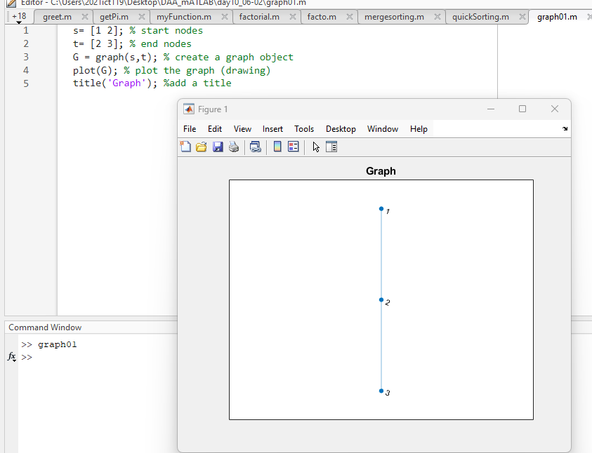|
|[graph02.m](./Codes/graph02.m)|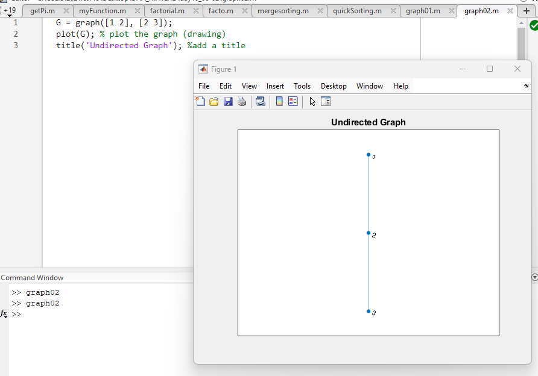|
|[graph03.m](./Codes/graph03.m)|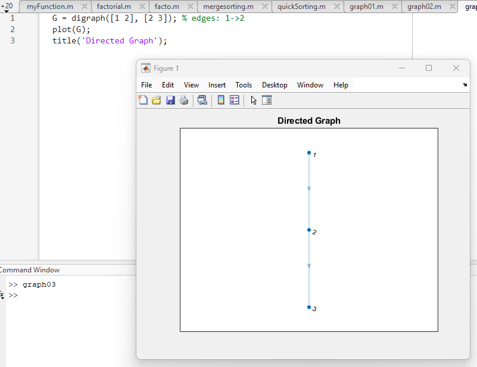|
|[graph04.m](./Codes/graph04.m)|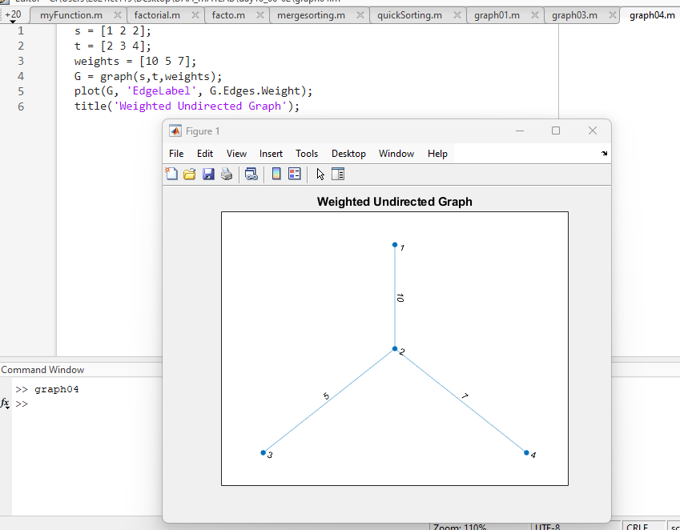|
|[graph05.m](./Codes/graph05.m)|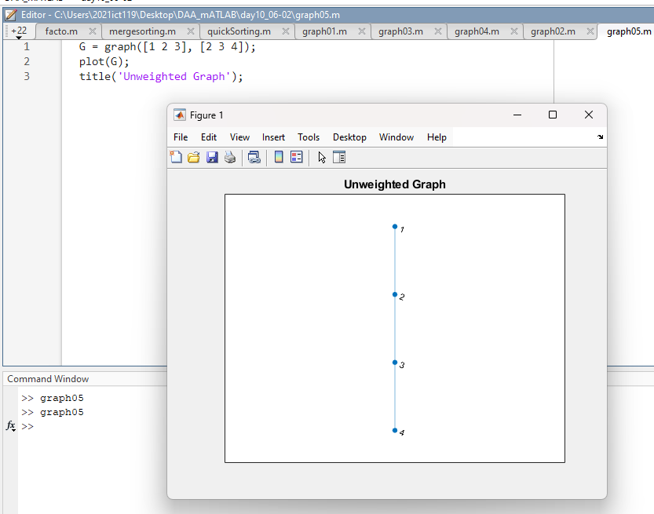|
|[graph06.m](./Codes/Adajecncy.m)|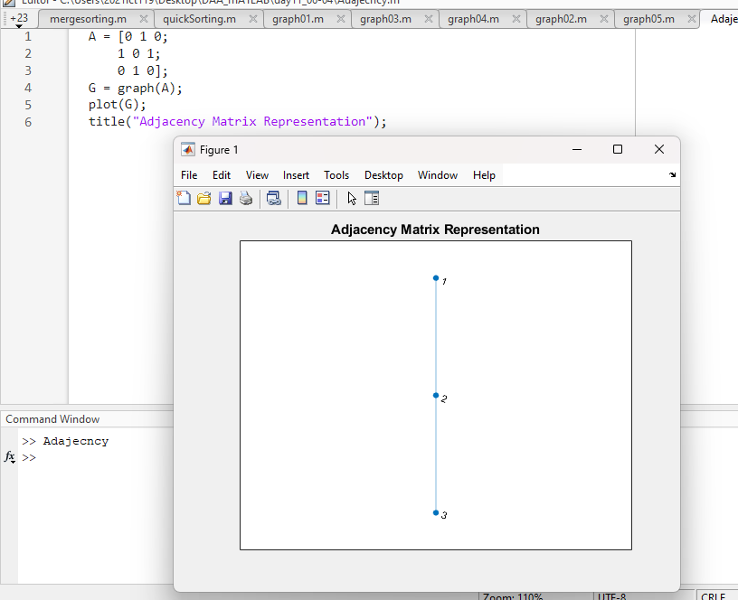|
|[graph07.m](./Codes/graph07.m)|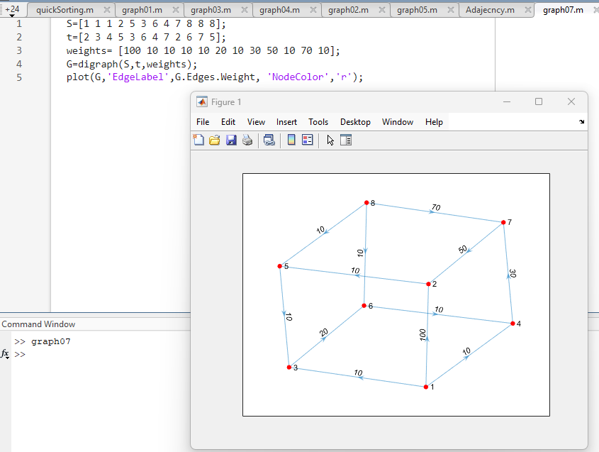|
|[graph08.m](./Codes/graph08.m)|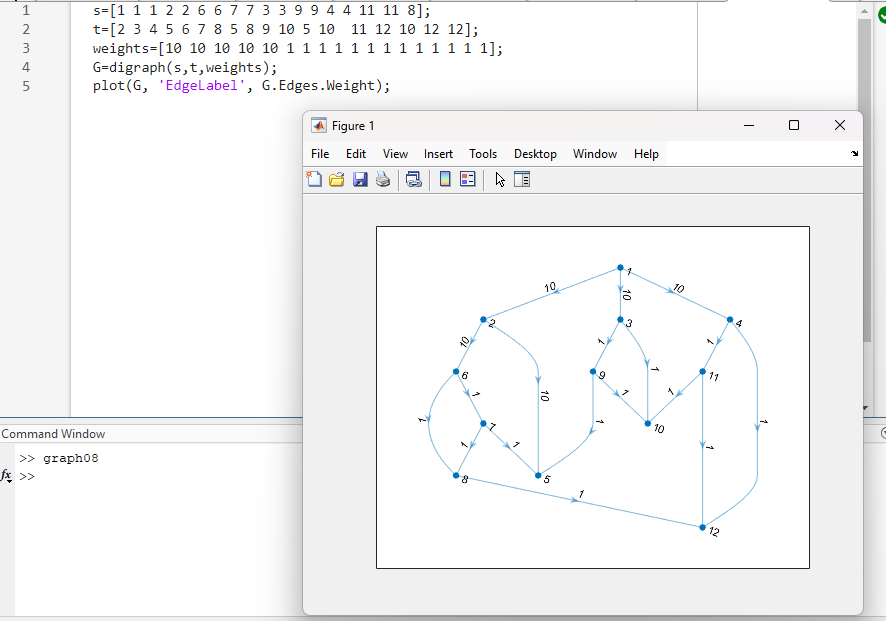|
|[graph09.m](./Codes/Adajecncy2.m)|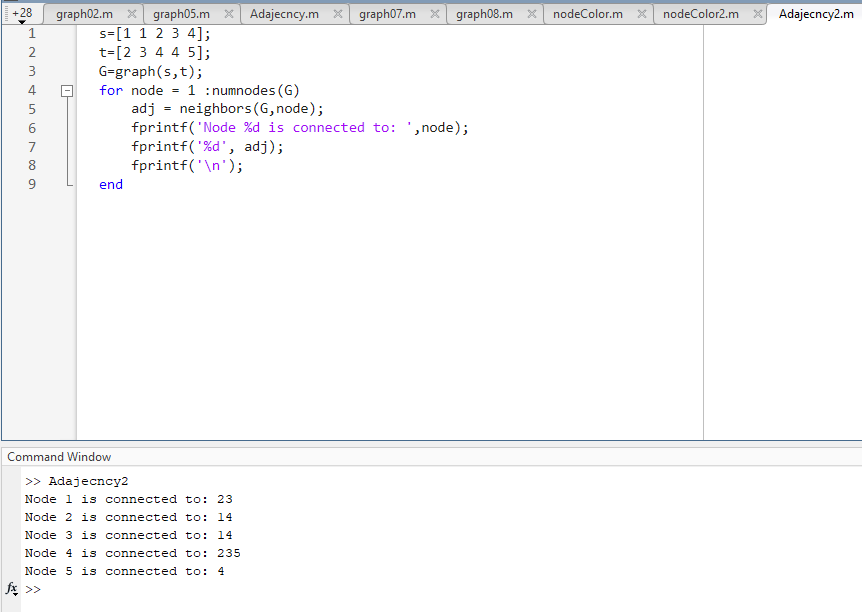|
|[nodeColor.m](./Codes/nodeColor.m)|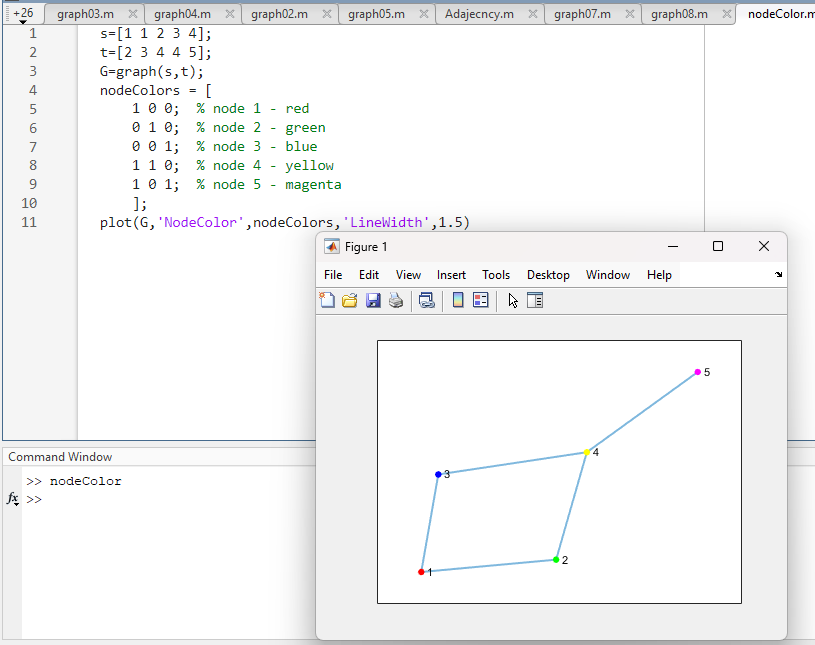|
|[nodeColor2.m](./Codes/nodeColor2.m)|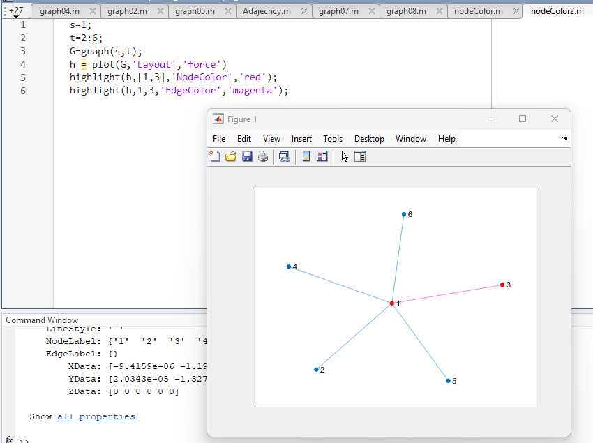|
|[graphImage.m](./Codes/graphImage.m)|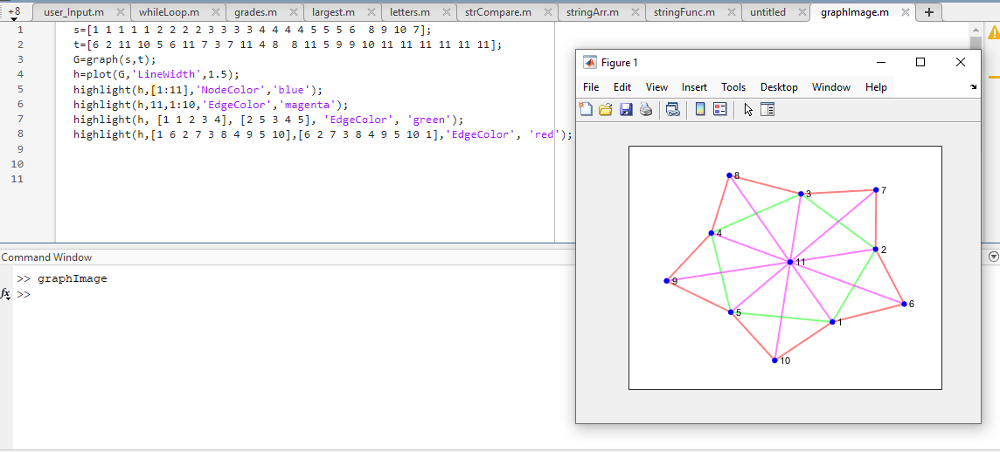|
